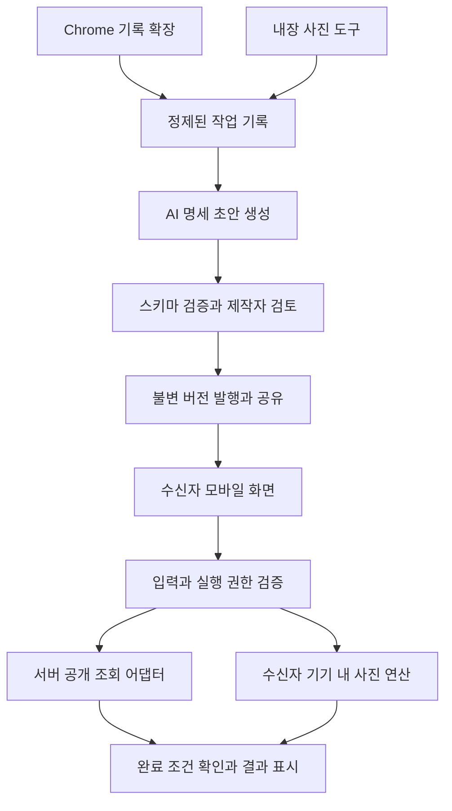

# 한번만 · 단일 SDD

> **한 번의 도움, 다음부터 스스로.**
>
> 사용자가 한 번 수행한 작업을, 다른 사람도 반복해서 사용할 수 있는 개인용 버튼으로 변환한다.

| 항목 | 내용 |
| --- | --- |
| 버전 | 0.5 |
| 작성일 | 2026-09-09 |
| 상태 | TAGO 계약·서버 조회 API·한국어 화면 구현. 실제 키를 이용한 외부 조회·인증·AI·제품 성능과 사업 가설은 미검증 |
| 문서 역할 | Spec-Driven Development를 위한 단일 제품·기술·검증 기준 |
| 소개 문서 | [README.md](./README.md) |

이 문서의 ‘해야 한다’는 구현 요구사항을 뜻한다. 구현 완료를 뜻하지 않는다. 이후 범위나 계약 변경은 이 문서를 먼저 갱신하고 요구사항·수용 기준을 함께 수정한다.

## 1. 제품 정의와 문제

한번만은 **다양한 작업을 개인 버튼으로 만들어 전달하는 서비스**다. 버스 조회는 이해하기 쉬운 예시이며, 제품을 교통 서비스로 제한하지 않는다.

사람이 가족의 디지털 작업을 대신 수행하면 결과는 전달되지만 수행 방법은 도와준 사람에게 남는다. 다음번에 날짜나 파일만 달라져도 같은 도움을 다시 요청하게 된다. 정적인 설명서는 화면 변화와 여러 단계의 선택을 모두 해결하기 어렵다.

제품은 한 번의 작업에서 다음을 분리한다.

- **공통 절차:** 지원하는 기능으로 실행할 단계.
- **고정 조건:** 다음에도 유지할 노선, 시간대, 사진 변환 규칙 등.
- **실행 입력:** 날짜, 선택한 파일 등 매번 달라지는 값.
- **결과 계약:** 무엇을 확인해야 완료인지와 어디서 멈추는지.

받는 사람에게는 위 내용을 수행하는 데 필요한 질문과 버튼만 보여준다. 한 번의 시연으로 사람의 의도를 완벽히 알 수 있다고 가정하지 않으며, 공유 전에 만든 사람이 명세를 검토한다.

## 2. 사용자와 사업 가설

| 역할 | 필요 | 권한 |
| --- | --- | --- |
| 제작자 | 평소 도와주던 작업을 재사용할 형태로 전달 | 기록·편집·검토·발행·공유·중지·삭제 |
| 수신자 | 익숙한 이름의 버튼으로 스스로 다시 수행 | 공유된 버전 열람, 입력, 1회 실행, 취소, 결과 확인 |
| 운영자 | 지원 기능의 호환성과 장애 관리 | 어댑터 등록·중지. 사용자 비밀번호나 사진 원본을 수집하지 않음 |

첫 검증 대상은 **최근 한 달 동안 같은 디지털 작업을 두 번 이상 대신해준 성인 자녀와 그 도움을 받은 가족**이다. 나이만으로 디지털 사용 능력을 가정하지 않는다.

제작자가 가족 이용권을 결제하는 모델을 실험한다. 무료 버튼 1개와 유료 다중 버튼·공유·관리 구성을 가설로 삼는다. 월 4,900원과 9,900원은 별도 집단에서 비교할 수 있는 실험 가격이며 확정 가격이 아니다. 결제 시스템과 무제한 사람 상담은 MVP에 넣지 않는다.

가장 큰 사업 위험은 버튼 고장 때문에 가족에게 원래 작업과 자동화 수리까지 맡겨지는 것이다. 설정·복구를 포함한 **총 도움 시간**이 감소해야 가치가 성립한다. 조회 버튼 하나의 사용성만으로 구독 수요가 검증되었다고 판단하지 않는다.

## 3. 범위와 지원 경계

### 3.1 MVP에 반드시 포함할 두 작업 유형

| 유형 | 제작 환경 | 수신자 입력 | 실행 | 결과 |
| --- | --- | --- | --- | --- |
| `public_query` | 등록된 공개 조회 화면 + PC Chrome 확장 | 날짜 등 검토된 변수 | 서버의 등록 어댑터 | 구조화한 실제 조회 결과, 사용 조건, 출처, 조회 시각 |
| `local_image_batch` | 서비스의 내장 사진 처리 화면 | 수신자가 직접 선택한 이미지 | 수신자 브라우저의 등록 연산 | 변환한 이미지 묶음 파일과 처리 요약 |

두 유형은 같은 생성·검토·공유 모델을 사용하지만 실행 위치와 데이터 경계가 다르다. 공유된 PC 화면의 좌표·DOM을 모바일에서 그대로 재생하는 구조가 아니다.

**공개 조회의 첫 연동 후보:** TAGO 고속버스 정보. 구현 착수 시 발급 조건, 실제 응답, 지원 터미널·날짜, 필드 의미와 갱신 상태를 확인한다. 검증된 항목만 공개하며, 잔여석과 예약은 별도 검증 없이 제공한다고 표시하지 않는다. API가 확인되지 않은 동안에는 이름과 화면에 `데모 데이터`를 명시한 샘플 어댑터만 사용할 수 있다. 샘플 실행은 실제 데이터 연동 수용 기준을 충족하지 않는다.

**사진 처리의 첫 범위:** JPEG·PNG·WebP 입력을 긴 변 기준으로 축소하고 JPEG로 내보낸다. 여러 파일은 ZIP으로 묶는다. 입력은 1~10개, 개별 20MB·전체 50MB·개별 24메가픽셀 이하로 제한한다. 기본 긴 변은 1,600px, 품질은 0.82다. 제작자가 정할 수 있는 긴 변은 정수 1~4,096px, 품질은 0.1~1.0이며 이 범위 안의 값을 기록·명세·실행에 그대로 유지한다. 원본보다 확대하지 않으며 방향 정보를 적용한 뒤 메타데이터를 제거하고, 투명 영역은 흰색으로 합성한다. SVG·GIF·HEIC와 깨진 파일은 변환 전에 안내한다. 출력 파일명은 원본 이름 대신 순번을 사용한다.

### 3.2 후속 확장

공개 강좌 검색 등은 새 조회 어댑터로 추가할 수 있다. 인증된 사이트의 자료 다운로드, 생필품 재주문 준비 등은 사용자 자신의 인증·실행 환경을 설계한 뒤 별도 버전으로 지원한다. 사진 외의 파일 변환도 등록 연산과 결과 계약을 추가하는 방식으로 확장한다.

### 3.3 MVP 제외

- 임의의 모든 웹사이트·모바일 앱 자동 학습과 제어.
- 한 번 시연하면 영구 작동하거나, 바뀐 화면을 항상 스스로 복구한다는 보장.
- 로그인, 본인 인증, CAPTCHA 우회, 계정·쿠키·세션 공유.
- 예약 확정, 결제, 구매, 계정 변경, 메시지·파일의 외부 전송.
- 외부 사진 편집기의 임의 클릭을 분석해 처리 코드를 자동 복원하는 기능.
- 무인 예약 실행, 공개 버튼 마켓, 가족 신원 인증, 앱스토어 배포.

## 4. 사용자 흐름과 화면

### 4.1 제작: 보여주기 → 초안 → 검토 → 발행

1. 제작자가 로그인하고 작업 유형과 지원 화면을 선택한다.
2. `기록 시작`을 누른 후 작업을 수행한다. 공개 조회는 확장이 등록된 페이지의 허용 이벤트를 기록한다. 사진은 내장 도구의 의미 있는 연산 이벤트를 기록한다.
3. `기록 종료` 후 AI에 보낼 정제된 기록을 확인한다. 비밀번호·인증정보·원본 파일·원본 파일명은 기록하지 않는다.
4. AI가 제목, 고정값, 입력값, 허용 단계, 결과·중단 조건을 포함한 초안을 생성한다.
5. 제작자가 고정값과 변수, 실행 범위, 공유되는 내용을 확인·수정한다. 불명확한 값은 확인 전까지 발행할 수 없다.
6. 구조 검증과 미리보기를 통과한 명세를 불변 버전으로 발행한다. 변경된 초안은 이전 확인을 무효화하고 다시 확인한다.
7. 발행된 버전에 연결된 비공개 링크를 생성한다. 링크 생성만으로 외부 메신저에 자동 전송하지 않는다.

### 4.2 수신: 열기 → 입력 → 실행 → 결과

1. 수신자가 링크를 열면 제목·목적·고정 조건·필요한 데이터·완료 범위를 본다.
2. 날짜 또는 본인 파일 등 필요한 입력만 제공한다. 고정 조건을 변경하려면 제작자가 새 버전을 발행해야 한다.
3. `실행`은 표시된 버전과 입력으로 **1회 수행**한다는 뜻이다. 반복 실행이나 더 넓은 권한을 승인한 것으로 취급하지 않는다.
4. 공개 조회는 서버가 수행하고, 사진 변환은 수신자 브라우저에서 수행한다.
5. 결과가 실제 완료 조건을 충족하면 표시한다. 실패·결과 없음·지원 중단은 다른 상태로 안내한다.
6. 수신자는 실행 결과와 실패 세부사항을 가족에게 보낼지 직접 결정한다. 제작자에게 수신자의 입력·결과·사진을 자동 전달하지 않는다.

### 4.3 수정과 공유 회수

발행된 버전은 수정하지 않는다. 제작자가 편집하면 새 초안이 생기고, 다시 검토·발행해야 한다. 기존 링크는 기존 버전에 고정된다. 새 버전은 새 링크로 전달한다.

제작자는 개별 링크를 회수하거나 버튼 전체를 중지할 수 있다. 회수·만료·중지는 새 실행과 아직 시작하지 않은 실행을 차단한다. 이미 시작된 실행은 원래 승인된 입력을 사용하며, 이미 전달된 화면·파일을 원격으로 회수한다고 약속하지 않는다. 실행 중 취소는 별도의 취소 계약을 따른다.

### 4.4 화면 목록

| 화면 | 필요한 내용 |
| --- | --- |
| 제작자 홈 | 내 버튼, 지원 유형, 초안·발행 버전, 중지·공유 관리 |
| 기록 화면 | 지원 여부, 기록 시작·종료, 수집 항목, 정제된 기록 미리보기 |
| 검토 화면 | 고정 조건, 변경 입력, 실행 위치, 완료 범위, 수신자 화면 미리보기 |
| 공유 화면 | 링크 만료일, 링크 소지자 접근 안내, 복사, 회수 |
| 수신자 버튼 | 쉬운 제목, 조건, 최소 입력, 실행, 출처·데이터 사용 설명 |
| 실행 결과 | 실제 상태, 결과, 사용 조건, 시각, 다운로드 또는 원문 링크 |

수신자 화면은 모바일 우선이며, 기본 글자 18px 이상·주요 터치 영역 48px 이상을 목표로 한다. 키보드와 스크린리더로 사용 가능해야 하며 상태를 색상만으로 구분하지 않는다. 취소·재시도·만료도 일상 언어로 설명한다.

## 5. 기능 요구사항

| ID | 요구사항 |
| --- | --- |
| FR-01 | 지원 화면에서 사용자가 명시적으로 시작·종료한 구간만 기록해야 한다. |
| FR-02 | 이벤트에서 목적·고정값·변수·단계를 추출하고 불명확한 항목을 표시해야 한다. |
| FR-03 | 제작자가 초안을 검토·수정해야 하며, 검증되지 않은 동작을 발행할 수 없어야 한다. |
| FR-04 | 발행된 명세에서 수신자 입력 화면을 생성해야 한다. 작업 이름으로 완성 화면을 고정 선택하지 않는다. |
| FR-05 | 발행 버전·공유 링크·실행 권한을 구분하고 회수·만료·중지를 적용해야 한다. |
| FR-06 | 공개 조회와 기기 내 사진 처리를 각각 등록된 실행 기능으로 수행해야 한다. |
| FR-07 | 실행 전 입력을 검증하고 동일 실행 요청의 중복 시작을 방지해야 한다. |
| FR-08 | 실제 결과와 명세의 완료 조건을 비교해야 하며 빈 결과와 성공을 구분해야 한다. |
| FR-09 | 오류·취소·재시도에서 날짜·대상·조건을 임의로 바꾸면 안 된다. |
| FR-10 | 사진과 인증정보의 데이터 경계를 지키고 불필요한 기록을 남기지 않아야 한다. |
| FR-11 | 서로 다른 두 작업을 같은 생성·검토·공유 흐름으로 만들 수 있어야 한다. |
| FR-12 | 실제 연동·데모 데이터·미지원 기능의 상태를 명확하게 표시해야 한다. |

## 6. 구조와 실행 경계



### 6.1 구성 요소

| 요소 | 책임 |
| --- | --- |
| Recorder | 등록 페이지의 의미 있는 입력·선택·실행 이벤트 수집과 정제 |
| Blueprint Compiler | 기록을 선언적인 작업 명세 초안으로 변환 |
| Validator | 타입·허용 기능·변수 참조·범위·완료 조건 검증 |
| Button UI | 명세에서 제작자 미리보기와 수신자 입력 화면 구성 |
| Share Service | 소유권, 불변 버전, 링크 상태, 실행 권한 확인 |
| Connector Registry | 서버 조회와 기기 내 연산의 버전별 입력·출력 계약 |
| Runner | 등록 기능 호출, 제한 시간, 취소, 결과 검증, 상태 관리 |

### 6.2 확정 기술 스택

2026-09-09 사용자가 승인한 MVP 기술 선택이다. 기술 선택과 실제 기능 구현·외부 서비스 연결 완료를 구분한다. 설치 버전은 package.json과 lockfile에 고정한다.

| 영역 | 기술 | 역할 |
| --- | --- | --- |
| 언어·런타임 | TypeScript, Node.js 24 | 웹·서버·확장의 작업 계약 공유 |
| 웹 UI | Next.js App Router, React, Tailwind CSS | 제작·검토·공유와 모바일 수신자 화면 |
| 서버 API | Next.js Route Handlers의 Node.js 런타임 | 권한 검사, AI 호출, 등록 조회 어댑터 실행 |
| DB | Supabase PostgreSQL | 명세·발행 버전·공유·실행의 영속 상태 |
| 제작자 인증 | Supabase Auth | 서버에서 확인하는 소유자 로그인 |
| 수신자 인증 | 자체 공유 토큰과 제한 세션 | 9.1의 비공개 링크 권한. Supabase 사용자 가입과 별개 |
| 작업 기록 | TypeScript, Chrome Manifest V3 | 등록된 페이지의 정제 이벤트 수집 |
| 사진 처리 | 브라우저 Worker, 이미지 변환·ZIP 라이브러리 | 수신자 기기에서 변환·다운로드 |
| AI | Gemini Developer API, Structured Outputs | 정제 이벤트를 JSON 명세 초안으로 변환 |
| 검증 | Zod, Vitest, Playwright | 계약·권한·상태 검사와 사용자 흐름 검증 |
| 배포·CI | Vercel, GitHub Actions | 웹·API 배포, 타입·테스트·빌드 자동 검증 |
| 저장소 구성 | pnpm workspace | `apps/web`, `apps/recorder`, `packages/contracts`, `packages/photo`, `packages/connectors` |

**배포 경계:** Vercel에서 웹과 API를 운영하고 Supabase에 상태를 저장한다. 공개 조회는 30초 제한 안에 끝내며 응답 후 메모리에서 계속 실행되는 작업에 의존하지 않는다. 실행·취소·멱등 상태를 DB에 저장한다. 장시간 브라우저 작업이 추가될 때 별도 실행 서버와 큐를 검토한다.

**AI 경계:** 서버에서 Gemini Developer API를 호출한다. 초기 평가 모델은 안정 버전 `gemini-3.1-flash-lite`로 하고 `GEMINI_MODEL`로 교체 가능하게 둔다. 출력 형식이 맞더라도 동작·참조·권한 검증과 제작자 검토를 통과해야 발행한다. 기록 변형·미지원 동작 평가로 운영 적합성을 확인하며 검증 전 생성 성능을 확정 수치로 표시하지 않는다. API 제공자 호출 코드는 명세 검증기와 분리한다.

**AI 비용 가정:** 2026-09-09 공식 Standard 요금 기준 텍스트 입력 100만 토큰당 $0.25, 출력(추론 포함) 100만 토큰당 $1.50이다. 생성당 입력 3,000·청구되는 출력 1,000 토큰이면 1,000회 약 $2.25이며 계산 예시일 뿐 실제 비용 보장은 아니다. 재시도·추가 추론·세금·다른 서비스 비용은 별도다. 실행 버튼을 누를 때마다 AI를 호출하지 않고 검토·발행한 명세를 재사용한다.

**저장 경계:** 사진 원본·변환본용 클라우드 저장소를 만들지 않는다. 보관 기한이 있는 DB 레코드는 Supabase Cron과 요청 시 만료 검사로 관리한다. 삭제 작업은 기한을 초과하지 않도록 설계·검증한다. 관리형 백업도 9.3의 삭제·보관 정책 대상이다.

### 6.3 계정과 환경변수 준비

| 서비스 | 사용자가 준비할 내용 | 필요한 시점 |
| --- | --- | --- |
| Supabase | `hanbeonman` 프로젝트 생성 완료, Healthy, Tokyo(`ap-northeast-1`). DB 비밀번호는 별도 보관 | 실제 인증·DB 연동 |
| Vercel | `ptarowanb/hanbeonman`의 `apps/web`을 `web` 프로젝트로 연결하고 첫 배포 완료 | Secret 입력 후 재배포·운영 검증 |
| Google AI Studio | Google 계정 로그인, 프로젝트의 Gemini API 키 생성, 실제 사용자 기록 처리 전 유료 API 조건 확인 | 실제 AI 명세 생성 |
| 공공데이터포털 | 가입 후 「국토교통부_(TAGO)_고속버스정보」 개발계정 활용신청 | 실제 공개 조회 검증 |

Supabase 회원가입만으로 DB가 생성되지는 않으므로 프로젝트까지 생성한다. URL과 Publishable key는 프로젝트 Connect 화면에서 확인한다. 서버의 관리용 키는 프로젝트 API Keys의 Secret key를 사용하며 클라이언트 번들에 포함하지 않는다. DB 비밀번호는 이 웹 앱의 환경변수에 넣지 않는다. 필요하면 마이그레이션 도구의 보안 입력에 별도로 사용한다.

웹 앱 설정 파일은 `apps/web/.env.local`이다. 파일이 없을 때만 예제를 복사한 뒤 로컬 편집기로 입력한다. 이미 입력한 값을 덮어쓰지 않는다.

```powershell
if (-not (Test-Path -LiteralPath apps/web/.env.local)) {
  Copy-Item -LiteralPath apps/web/.env.example -Destination apps/web/.env.local
}
```

| 변수 | 공개 여부 | 용도 |
| --- | --- | --- |
| `NEXT_PUBLIC_SUPABASE_URL` | 공개 설정 | Supabase 프로젝트 주소 |
| `NEXT_PUBLIC_SUPABASE_PUBLISHABLE_KEY` | 공개 설정 | Supabase 공개 클라이언트 키. 접근 권한은 서버·RLS에서 검사 |
| `SUPABASE_SECRET_KEY` | 서버 비밀 | 서버의 권한 있는 DB 작업. 모든 소유권·공유 권한 검사는 별도 수행 |
| `GEMINI_API_KEY` | 서버 비밀 | AI 명세 생성 |
| `GEMINI_MODEL` | 서버 설정 | 초기값 `gemini-3.1-flash-lite`, 운영 전 실제 기록으로 평가 |
| `TAGO_SERVICE_KEY` | 서버 비밀 | 공공데이터포털 일반 인증키(Decoding) |

실제 키는 채팅·커밋·스크린샷·로그에 포함하지 않는다. `.env.local`은 Git에서 제외하며 저장소에는 빈 `.env.example`만 둔다. Vercel에도 같은 이름으로 필요한 환경변수를 등록하고 변경 후 재배포한다. 미설정 상태에서는 해당 외부 기능을 사용할 수 없다고 표시하며 샘플 응답을 실제 연동처럼 반환하지 않는다.

개발 환경과 공통 계약 테스트는 외부 키 없이 실행한다. 배포 시 Vercel 프로젝트의 Root Directory는 `apps/web`으로 지정하고 workspace 공통 패키지가 빌드에 포함되는지 검증한다. Supabase Auth URL 설정은 실제 로컬·배포 주소가 정해진 뒤 등록한다.

### 6.3.1 확인된 TAGO 계약과 구현 상태

첨부된 국토교통부(TAGO) 고속버스정보 가이드와 개발계정 화면에서 다음 계약을 확인했다. 서비스 기본 주소는 `https://apis.data.go.kr/1613000/ExpBusInfo`이며, 시간표 조회는 `GetStrtpntAlocFndExpbusInfo`를 사용한다. JSON 요청에는 `serviceKey`, `depTerminalId`, `arrTerminalId`, `depPlandTime(YYYYMMDD)`가 필요하고 `pageNo`, `numOfRows`, `busGradeId`를 선택할 수 있다. 응답은 `routeId`, `gradeNm`, `depPlandTime`, `arrPlandTime`, `depPlaceNm`, `arrPlaceNm`, `charge`를 검증한 일정으로 정규화한다. 터미널·등급·도시 코드 조회는 후속 등록 대상으로 남긴다.

`packages/connectors`와 `GET /api/tago/schedules`는 이 계약을 기준으로 구현했다. 서비스 키가 없으면 `NOT_CONFIGURED`, 정상 응답에 일정이 없으면 `EMPTY`, 공급자 인증·응답 계약 오류는 `NEEDS_ATTENTION`, 네트워크·HTTP 오류는 `FAILED`로 표시한다. 응답에는 예약·결제·잔여석을 지원하지 않는다는 출처 경계를 포함하며, 요청 URL·서비스 키를 브라우저 응답이나 오류 메시지에 노출하지 않는다. 합성 응답 테스트와 UI 상태 검증, Production 단일 조건 실제 조회까지 완료했으며, 실제 키로 10개 조건을 조회하는 AC-09 검증은 아직 실행하지 않았다.

**비용·AI 데이터 조건:** Gemini 무료 API는 제품 개선에 입력·출력을 사용할 수 있으므로 개발용 합성 기록에 한정한다. 실제 사용자 기록은 제품 개선에 사용하지 않는 유료 API 조건을 적용하고 9.2의 정제·최소 전송을 유지한다. AI Studio에서 키를 만든 뒤 해당 프로젝트의 할당량·결제 상태를 확인한다. Supabase 무료 플랜으로 개발을 시작할 수 있으나 심사 기간의 중단·할당량 조건을 확인해야 한다. Vercel Hobby는 개인·비상업 용도로 제한되므로 사업 운영에는 적합한 유료 플랜을 선택한다. 유료 전환·도메인 구매는 사용자가 별도로 진행한다.

### 6.4 어댑터 원칙

등록 어댑터는 `id`, `version`, `executionTarget`, `inputSchema`, `outputSchema`, `capabilities`, `timeoutMs`, `resultValidator`를 가진다. 공개 조회 어댑터만 검증된 고정 출처로 요청할 수 있다. 임의 URL·스크립트·DOM 선택자를 명세에서 받아 실행하지 않는다.

지원 사이트의 기록을 공개 API 호출로 변환하려면 사이트 이벤트와 API의 의미를 연결하는 매핑을 사전에 구현해야 한다. 이 매핑은 지원 범위이며 AI가 새 외부 연동을 자동 완성했다고 표현하지 않는다. 응답 형식이 바뀌면 어댑터 검증에 실패해야 하며, 이전 조건과 다른 요청을 만들어 회피하지 않는다.

Chrome 확장은 사용자가 요청한 지원 페이지에만 필요한 권한으로 동작한다. 공유 링크 자체에는 외부 앱을 조작할 권한이 없다. 모바일 앱 전체 제어는 이 구조의 일부가 아니다.

### 6.5 비밀 키 보관과 유출 방지

실제 키는 공개·비공개 저장소 모두에 커밋하지 않는다. Git에는 변수 이름과 빈 예제만 두고, 실행 환경에서 값을 주입한다. Git에서 제외된 로컬 파일도 암호화된 금고는 아니므로 개인 OS 계정으로 접근을 제한하고 원본 키와 DB 비밀번호는 비밀번호 관리자에 보관한다.

| 위치 | 보관할 내용 | 적용 방법 |
| --- | --- | --- |
| Git | 빈 키 예제, 비밀이 아닌 모델 이름, 설정·검사 코드 | `.env`와 `.env.*` 제외. `.env.example`만 예외이며 키 값은 비워 둠 |
| 개발 PC | 개발용 키 | `apps/web/.env.local`에 편집기로 입력. 채팅·명령줄 인수에 값을 붙여넣지 않음 |
| Vercel Development·Preview | 별도 개발 프로젝트의 키 | 프로젝트 Environment Variables의 Type을 **Secret**으로 등록 |
| Vercel Production | 운영 프로젝트의 전용 키 | **Secret**으로 등록하고 운영 환경에만 적용. 변경 후 재배포 |
| GitHub Actions | 이 단계에서는 외부 서비스 키가 필요 없음 | 합성 데이터로 검사. 향후 필요한 CI 전용 값만 GitHub Secrets에 최소 범위로 등록 |

Vercel의 Secret은 저장 후 값을 다시 읽을 수 없는 설정 유형이다. URL·모델명·Supabase Publishable key 같은 공개 설정은 Config를 사용해도 되지만, 실제 설정값은 이 저장소의 예제에 넣지 않는다. 운영 키를 Preview·개발 환경에 재사용하지 않으며 신뢰하지 않는 PR 코드에 키를 주입하지 않는다. [Vercel 환경변수 유형과 범위](https://vercel.com/docs/environment-variables/sensitive-environment-variables).

**애플리케이션 구현 규칙:** Gemini·TAGO·Supabase Secret key를 사용하는 코드는 Next.js 서버 경계로 분리하고 서버에서만 읽는다. 현재 TAGO 키는 `GET /api/tago/schedules` Route Handler에서만 읽으며, 브라우저는 검증된 결과와 상태만 받는다. 비밀 변수에 `NEXT_PUBLIC_` 접두사를 붙이거나 `next.config`의 `env`로 주입하지 않으며, 응답·클라이언트 props·에러 메시지·로그에 포함하지 않는다. 브라우저에는 Supabase URL과 Publishable key만 전달한다. Publishable key는 브라우저에서 공개되는 값이며, 데이터 접근은 Auth·RLS로 제한한다. Secret key는 RLS를 우회하므로 서버의 소유권·공유 세션 검사를 생략할 수 없다. [Supabase 키 권한](https://supabase.com/docs/guides/getting-started/api-keys).

**개발 단계 검사:** 로컬 커밋 훅은 스테이징된 환경 파일과 예제의 채워진 키를 거부하고, Gitleaks로 추가되는 비밀 패턴을 검사한다. 검사기가 없거나 실행에 실패하면 커밋을 중단한다. 별도 CI는 Git 이력을 Gitleaks로 검사하며 비밀 값·원문 보고서·PR 댓글을 게시하지 않는다. 로컬 훅은 새 clone에서 설치해야 하고 우회될 수 있으며 CI는 푸시 후 검사이므로, 어느 한 검사도 유출 방지를 보장하지 않는다. 저장소 권한과 코드 리뷰를 함께 적용한다.

**유출 대응:** 값이 Git·로그·채팅에 노출되면 제공자에서 해당 키를 폐기·교체하고 로컬·배포 설정을 갱신한다. 커밋에서 지우는 것만으로 복구되었다고 판단하지 않는다. 접근 기록을 확인하며 공유 이력의 재작성은 별도 영향 검토 후 진행한다.

## 7. 데이터와 명세 계약

### 7.1 주요 엔터티

| 엔터티 | 필수 내용 |
| --- | --- |
| RecordingSession | 소유자, 유형, 지원 소스 ID, 정제 이벤트, 시작·종료 시각, 만료 시각 |
| WorkflowVersion | 버튼 ID, 버전, 초안 또는 발행 상태, 스키마 버전, 명세, 검토 해시, 생성·발행 시각 |
| Button | 소유자, 제목, 중지 여부, 삭제 상태 |
| ShareLink | 불변 버전 ID, 토큰 해시, 만료 시각, 회수 시각 |
| Run | 공유 ID, 실행을 시작한 공유 세션 ID, 버전 ID, 서버가 고정한 입력, 상태, 멱등 키, 만료 시각, 오류 코드, 결과 참조 |

사진 Run에는 원본 파일명·파일 객체·내용·EXIF·변환본을 서버 저장하지 않는다. 서버에는 유형과 실행 상태만 보관한다. 기기 내 실제 파일 결과는 수신자 브라우저에만 존재한다.

### 7.2 정제 이벤트

각 이벤트는 `sequence`, `sourceId`, `operation`, `fieldKey`, `safeValue`와 상대 시각을 가진다. 화면 전체의 HTML·영상·키 입력을 기본 수집하지 않는다. 등록된 필드만 허용 목록 방식으로 수집한다. 사진 선택은 실제 파일 대신 `recipient_file_input`이라는 자리표시자로 기록한다.

미지원 이벤트는 위치와 이유만 표시하고 지원되는 것처럼 조용히 생략하지 않는다. 사용자 발언이나 외부 페이지의 문구는 분석할 데이터이며 실행 권한을 바꾸는 지시로 취급하지 않는다.

### 7.3 작업 명세 예시

아래는 설계한 내부 계약의 예시다. 외부 API의 실제 응답이나 구현된 코드가 아니다. 제목·입력 이름은 한국어로 표현하고, 고정 필드와 상태 값은 코드에서 안정적으로 참조할 식별자를 사용한다.

```json
{
  "schemaVersion": "1.0",
  "taskKind": "local_image_batch",
  "title": "사진 줄여서 파일 만들기",
  "executionTarget": "recipient_browser",
  "adapter": { "id": "image.resize_export", "version": "1" },
  "inputs": [
    {
      "key": "photos",
      "label": "줄일 사진을 골라주세요",
      "type": "image_files",
      "required": true,
      "minItems": 1,
      "maxItems": 10,
      "localOnly": true
    }
  ],
  "constants": {
    "maxEdge": 1600,
    "quality": 0.82,
    "format": "jpeg",
    "stripMetadata": true
  },
  "steps": [
    { "operation": "validate_images", "inputRef": "photos" },
    { "operation": "resize_export", "inputRef": "photos", "configRef": "constants" },
    { "operation": "package_zip" }
  ],
  "completion": {
    "type": "all_outputs_created",
    "countMatchesInput": true
  },
  "output": { "type": "download", "filename": "hanbeonman-photos.zip" }
}
```

`operation`과 참조는 등록된 문법만 허용하며 JavaScript·셸·임의 표현식을 평가하지 않는다. 파일 제한·사진 규칙은 어댑터가 추가로 강제한다. AI가 명세에서 제한을 늘리거나 메타데이터 제거를 해제할 수 없다.

공개 조회 명세는 `taskKind=public_query`, `executionTarget=server`와 등록 조회 어댑터를 사용한다. 입력은 실제 연결 기능이 지원하는 날짜·조건이고, 결과 계약은 요청 조건 일치·필수 필드 존재·출처 확인이다. 공식 터미널 ID와 날짜 의미를 샘플 값으로 대체해 실제 값처럼 실행하지 않는다.

### 7.4 상태와 결과

버전 상태는 `DRAFT → PUBLISHED`이며 발행 후 불변이다. 버튼 중지는 별도 플래그다. 공유 상태는 `ACTIVE`, `REVOKED`, `EXPIRED`로 구분한다.

Run은 `QUEUED → RUNNING` 후 다음 중 하나로 끝난다.

| 상태 | 의미 |
| --- | --- |
| `SUCCEEDED` | 결과 검증을 통과했으며 사용할 실제 결과가 있음 |
| `EMPTY` | 올바른 조건으로 조회했으나 결과가 없음 |
| `NEEDS_ATTENTION` | 인증 요구·지원 중지·불명확한 응답 등으로 이어갈 수 없음 |
| `FAILED` | 제한 시간·상위 서비스·파일 처리 등의 오류 |
| `CANCELED` | 취소 요청이 적용되어 결과를 새 성공으로 표시하지 않음 |

공개 조회 결과는 `sourceId`, `sourceUrl`, `queriedAt`, `requestedConditions`, `items`를 포함한다. 실제 원천 갱신 시각을 제공받은 경우 `sourceUpdatedAt`으로 별도 표시한다. 조회 시각만으로 원천 데이터가 실시간이라고 주장하지 않는다.

사진 결과는 기기 내에서 `inputCount`, `outputCount`, 변환 설정, 실제 다운로드 파일을 확인한다. 서버가 받은 클라이언트 상태를 원본 사진 처리의 독립적인 검증 증거로 간주하지 않는다.

## 8. API 기능 계약

경로와 동작은 구현 목표다. 소유자 API는 소유권을, 수신자 API는 유효한 공유 세션을 매 요청 확인한다. 실행 조회·취소·로컬 완료는 Run에 저장된 시작 세션 ID까지 일치해야 한다. 같은 링크를 새로 연 다른 세션도 이전 세션의 실행에 접근할 수 없다. 외부 페이지 내용이나 입력의 버튼 ID만으로 권한을 결정하지 않는다.

| 메서드·경로 | 입력 | 결과·조건 |
| --- | --- | --- |
| `POST /api/recordings` | 지원 소스와 정제 이벤트 | 소유자에게 기록 ID 반환 |
| `POST /api/recordings/{id}/compile` | 해당 소유자의 기록 | 최초 변환 시 Button과 초안 생성, 버튼 ID·초안·확인 항목 반환. 자동 발행 없음 |
| `PATCH /api/buttons/{id}/draft` | 고정값·입력·제목 수정 | 검토 해시 갱신, 이전 확인 무효화 |
| `POST /api/buttons/{id}/publish` | 검토한 초안의 해시 | 해시와 현재 초안 일치 시 불변 버전 생성 |
| `POST /api/buttons/{id}/shares` | 발행 버전, 유효기간 | 소유자에게 공유 URL 반환 |
| `POST /api/shares/claim` | 비공개 링크 토큰 | 토큰 검증 후 제한된 공유 세션 발급 |
| `GET /api/shared-button` | 공유 세션 | 고정 버전의 수신자 화면 명세 반환 |
| `POST /api/runs` | 공개 조회 입력 또는 로컬 실행 유형, 멱등 키 | 실행 ID와 고정 버전 반환. 명세 자체는 클라이언트에서 받지 않음 |
| `GET /api/runs/{id}` | 동일 공유 세션 | 해당 공유의 실행 상태·허용 결과 반환 |
| `POST /api/runs/{id}/cancel` | 동일 공유 세션 | 취소 상태 반환 |
| `POST /api/runs/{id}/local-complete` | 로컬 실행 상태 | 사진 데이터 없이 상태만 기록. 서버 조회에는 사용 불가 |
| `DELETE /api/shares/{id}` | 소유자 세션 | 링크 회수, 신규·대기 실행 차단 |
| `PATCH /api/buttons/{id}` | 소유자의 중지 여부 | 해당 버튼의 신규 실행 허용 여부 갱신 |
| `DELETE /api/buttons/{id}` | 소유자 세션 | 링크 즉시 차단, 보관 정책에 따라 관련 데이터 삭제 |

입력 형식 오류는 `400`, 세션 부재는 `401`, 권한 오류는 `403`, 없는 자원은 `404`, 버전 충돌은 `409`, 공유 만료·회수는 `410`, 호출 제한은 `429`로 구분한다. 이미 승인된 비동기 실행에서 발견된 오류는 Run 상태·오류 코드로 표시한다. 타인 자원의 존재를 노출하지 않도록 자원 조회의 권한 실패는 일관된 `404` 응답을 사용할 수 있다.

## 9. 공유·개인정보·운영 제한

### 9.1 공유 모델

MVP는 가족 신원 확인 대신 **비공개 링크 소지 권한**을 사용한다. 링크를 전달받은 사람이 다시 공유할 수도 있으므로 ‘지정 가족만 접근’이라고 표시하지 않는다. 제작자는 고정값과 공유 내용을 미리 본다.

토큰은 최소 128비트의 암호학적 난수로 생성하고 해시만 저장한다. 기본 유효기간은 7일, 선택 가능한 최장 기간은 30일이다. 링크 토큰은 URL fragment로 전달하고, 클라이언트가 claim 요청을 보낸 뒤 주소에서 제거한다. claim은 `Secure`, `HttpOnly`, `SameSite=Lax`의 제한된 세션 쿠키를 발급한다. 세션은 최대 1시간이며 공유 만료를 넘지 않는다. 상태 변경 요청은 Origin을 확인하고 공유 세션만으로 소유자 API에 접근할 수 없다.

공유 세션 발급 후에도 실행 요청마다 회수·만료·버튼 중지 여부를 재검증한다. 로그·분석에는 토큰·쿠키·원본 URL fragment를 남기지 않는다. 수신자 화면은 외부 추적 스크립트를 기본 포함하지 않는다.

### 9.2 데이터 경계

- 제작자의 비밀번호, 쿠키, 인증 토큰, 개인 식별 번호, 폼의 미등록 필드를 수집하지 않는다.
- AI에는 제작자가 확인한 정제 이벤트만 전달한다. 공개 화면도 개인정보가 포함될 수 있으므로 전체 HTML을 보내지 않는다.
- 사진·파일명·메타데이터·변환본은 AI와 서버에 보내지 않는다. 로컬 처리에 필요한 파일 접근은 수신자가 직접 선택한 파일로 한정한다.
- 수신자의 실행 결과를 제작자 대시보드에 자동 노출하지 않는다. 진단 공유는 수신자가 검토한 상태·오류 코드만 전달하는 방식으로 시작한다.
- 조회 요청은 등록된 어댑터의 검증된 인자만 사용한다. 임의 URL 요청, 내부망 요청, 미등록 연산과 실행 코드는 차단한다.

### 9.3 보관과 비용 한도

정제 기록은 생성 후 24시간 안에 자동 삭제한다. 작업 명세는 소유자가 삭제할 때까지 보관한다. 공개 조회 입력·결과는 Run 생성 후 1시간 이내 삭제하고, 사진 데이터는 처음부터 서버 보관하지 않는다. 최소 운영 로그에는 상태·어댑터 버전·처리 시간·오류 코드만 7일간 남긴다. 버튼 삭제 요청은 신규 접근을 즉시 막고 연관 데이터는 24시간 안에 제거한다. 백업을 운영한다면 별도 복구 보관 기간과 삭제 정책을 공개하기 전까지 실사용 데이터를 백업하지 않는다.

초기 운영 제한은 공유당 하루 20회 실행, 동시 공개 조회 1회, 소유자당 하루 20회 명세 생성으로 시작한다. 한도는 서버 설정으로 관리하며 초과 시 새 과금을 발생시키거나 몰래 재시도하지 않는다. 공개 조회 제한 시간은 30초다. 로컬 처리는 파일을 순차 처리하고 총 60초 제한을 두며 기기 성능 차이를 안내한다.

## 10. 오류·취소·재시도

| 상황 | 처리 |
| --- | --- |
| 잘못된 날짜·누락 입력·파일 한도 초과 | 실행 전 입력 오류 표시 |
| 모호한 고정값·미지원 동작 | 초안 단계에서 확인 필요 표시, 발행 차단 |
| 유효한 조회의 빈 결과 | `EMPTY`. 날짜나 노선을 임의 변경하지 않음 |
| 인증·CAPTCHA·미등록 화면·응답 계약 변경 | `NEEDS_ATTENTION`. 현재 범위에서 중단 |
| 외부 서비스 실패·시간 초과 | `FAILED`, 쉬운 설명과 동일 조건 재시도 제공 |
| 이미지 해독·변환 실패 | `FAILED`, 실패한 순번 안내. 일부 성공을 전체 완료로 표시하지 않음 |
| 링크 만료·회수·버튼 중지 | 시작 전 차단. 대기 중이면 `CANCELED` 처리 |
| 수신자가 취소 | 가능한 요청·Worker 작업을 중단하고 늦은 응답으로 성공 상태를 덮어쓰지 않음 |

공개 조회는 서버가 고정한 버전과 입력으로 실행한다. 같은 공유·시작 세션·멱등 키의 요청은 같은 실행 ID를 반환하며 다른 입력이 동반되면 충돌로 거부한다. 명시적인 재시도는 기존에 확인한 조건과 버전을 복사하고 새로운 멱등 키를 사용한다. AI가 오류를 핑계로 다른 작업을 수행하지 않는다. 성공·실패·취소 등 종료 상태는 지연 응답으로 덮어쓰지 않는다.

사진 처리 중 취소하면 생성 중인 임시 파일과 객체 URL을 정리한다. 이미 사용자가 저장한 다운로드는 취소로 회수할 수 없다. 완료 상태 이후의 취소 요청은 상태를 되돌리지 않고 이미 완료되었음을 반환한다.

## 11. 수용 기준

아래 항목은 **검증 목표이며 아직 실행 결과가 아니다.** 테스트는 구현을 그대로 되풀이하는 대신 권한·입력·실제 결과의 경계를 검증한다.

| ID | 검증 시나리오 | 통과 조건 | 요구사항 |
| --- | --- | --- | --- |
| AC-01 | 지원 페이지에서 기록 시작 전·후와 기록 중 이벤트 발생 | 선택한 구간의 허용 이벤트만 남음 | FR-01, FR-10 |
| AC-02 | 같은 조회에서 노선·시간대 등 실제 수행값을 바꾸어 두 번 기록 | 생성 명세의 값이 각 기록에 맞게 달라짐 | FR-02, FR-04 |
| AC-03 | 제작자가 날짜를 고정값에서 실행 입력으로 변경 | 수신자 화면과 실행 인자가 함께 변경되며 재검토가 요구됨 | FR-03, FR-04 |
| AC-04 | 공개 조회와 사진 처리를 각각 시연 | 같은 발행·공유 흐름에서 서로 다른 입력·단계·결과 명세가 생성됨 | FR-06, FR-11 |
| AC-05 | 기록에 미지원 동작 또는 악의적인 페이지 문구 포함 | 미지원 동작은 해결 전 발행 차단. 페이지 문구는 실행 지시로 사용하지 않으며 임의 실행·권한 확대 없음 | FR-02, FR-03, FR-10 |
| AC-06 | 기존 버전 공유 뒤 제작자가 새 초안을 편집·발행 | 기존 링크·진행 중 실행은 고정된 이전 버전을 유지 | FR-05, FR-09 |
| AC-07 | 타인의 소유자용 명세 API 또는 다른 세션이 시작한 Run에 접근 | 접근 거부. 같은 공유 링크라도 시작 세션이 다르면 타인의 실행 조회·취소·로컬 완료 불가 | FR-05, FR-10 |
| AC-08 | 회수·만료·중지된 버튼 실행과 중복 클릭 | 신규 실행 차단, 동일 멱등 키는 한 번만 시작 | FR-05, FR-07 |
| AC-09 | 같은 검증 시점에 원천에서 정상 결과가 확인된 지원 조건 10개로 실제 조회 | 10건 모두 완료하고 요청 조건·원천 결과와 일치. 실패 건은 통과로 세지 않음 | FR-06, FR-08 |
| AC-10 | 빈 결과·상위 장애·응답 필드 변경·시간 초과 주입 | `EMPTY`, `FAILED`, `NEEDS_ATTENTION`을 구별하고 입력을 보존 | FR-08, FR-09 |
| AC-11 | 사진 처리의 네트워크와 서버·AI 요청 검사 | 원본·변환본·파일명·메타데이터 전송 0건 | FR-10 |
| AC-12 | 방향 정보·투명 영역·한도·잘못된 형식을 포함한 사진 처리 | 규정된 변환, 메타데이터 제거, 출력 수·파일 확인. 오류는 명시 | FR-06, FR-08 |
| AC-13 | 서버 조회와 로컬 처리 중 취소 후 지연 응답 도착 | 취소가 먼저 확정되면 뒤늦은 성공 덮어쓰기 없음 | FR-09 |
| AC-14 | 결과 화면과 파일을 확인 | 조회에는 조건·출처·시각, 사진에는 실제 결과 파일이 있음 | FR-08, FR-12 |
| AC-15 | 처음 보는 수신자 3명이 모바일에서 두 작업 유형을 각각 실행 | 3명 모두 구두 안내 없이 입력부터 결과 확인까지 완료. 실패하면 개선 후 새 참여자로 다시 검증 | FR-04, FR-11 |
| AC-16 | 모의 어댑터와 실제 연동을 각각 실행 | 화면·결과에 모의 여부 표시. 실제 연동 완료와 혼동 없음 | FR-12 |
| AC-17 | 보관 기한 경과·삭제 요청 후 저장소와 접근 검사 | 9.3의 기한에 따라 제거되고 공유 실행 불가 | FR-05, FR-10 |

AC-02~04는 **기록에서 명세가 실제로 생성되는지** 검증한다. 시나리오 이름이나 고정 제목을 보고 미리 만든 결과를 반환하는 데모는 통과하지 못한다. 실행 기능을 사전 구현하는 것은 허용하지만 사용자가 보여준 구조와 값까지 고정해 두면 안 된다.

AC-09는 실제 데이터 연동 단계의 기준이다. 샘플 데이터로 엔진을 검증한 경우 별도로 기록하고 이 기준을 통과했다고 표시하지 않는다. 실제 사용자 관찰 결과나 처리 성공률도 측정 전에는 숫자를 성과로 발표하지 않는다.

## 12. 구현 순서와 출시 판단

기능 단위 task로 구현·검증·검토한 뒤 커밋·푸시한다. 커밋 유형은 `docs`, `feat`, `fix`, `test`, `chore`를 사용하고 설명은 한국어로 작성한다. 상태는 해당 작업의 실제 검증 결과가 있을 때만 갱신한다.

| Task | 산출물 | 선행 작업 | 검증 기준 | 상태 |
| --- | --- | --- | --- | --- |
| T-01 공통 기반 | workspace, 웹 초기 화면, 이벤트·명세·상태 검증, CI | 없음 | 타입·허용 동작·참조 거부, 빌드·모바일 화면 | 로컬 검증 완료 |
| T-02 제작자와 버전 | Supabase 인증, 소유권, 초안 저장, 불변 발행 | T-01, Supabase 연결 | AC-03·06·07의 소유자/버전 범위 | 예정 |
| T-03 공개 조회·기록 | TAGO 계약·서버 API·조회 화면, 데모/실제 구분, Chrome 기록 | T-01, TAGO 키 | AC-01·09·10·14·16 | TAGO 계약·서버 API·조회 화면 구현. 기록·실제 10건 검증 대기 |
| T-04 사진 도구 | 기기 내 변환·ZIP, 의미 있는 연산 기록 | T-01 | AC-11·12·14 | 브라우저 변환·ZIP 로컬 검증 완료. 의미 있는 연산 기록은 후속 |
| T-05 AI 생성·검토 | 기록별 명세 초안, 고정/변수 편집, 수신자 미리보기 | T-02·03·04, Gemini 키 | AC-02~05 | 예정 |
| T-06 공유 권한 | 버전별 링크, 제한 세션, 회수·만료·중지 | T-02·05 | AC-06~08 | 예정 |
| T-07 모바일 실행 | 명세 기반 입력, 서버/로컬 실행, 취소·재시도 | T-03·04·05·06 | AC-07·08·10·13·14 | 예정 |
| T-08 출시 검증 | 배포, 보관·삭제 검사, 모바일 사용자 관찰, 데모 | T-01~07 | AC-01~17 종합. 실제 외부 연동·사용자 검사 별도 기록 | 예정 |

T-02·03·04는 공통 계약 이후 서로 겹치지 않는 범위에서 병렬 진행할 수 있다. 외부 계정이 없을 때에는 T-01과 사진 처리 등 독립 작업을 진행한다. 실제 API가 없는 샘플 테스트는 실제 조회 수용 기준의 대체물이 아니다.

**T-01 검증 기록(2026-09-09):** frozen lockfile 설치, 공통 검증 단위 테스트 39개, 전체 타입 검사, Next.js 프로덕션 빌드, 데스크톱·393px·320px Chromium 화면 테스트 3개가 로컬에서 통과했다. 이 기록은 실제 Gemini 호출·Supabase 접근 제어·공개 조회·사진 변환·사용자 관찰 및 AC 전체 통과를 뜻하지 않는다. CI 정의를 추가했으며 원격 실행 결과는 GitHub Actions에서 확인한다. 공통 검증과 웹 화면은 각각 독립 커밋·푸시한다.

**T-04 검증 기록(2026-09-09):** 사진 입력·제한·순번 출력명·ZIP 헤더 단위 테스트 5개와 데스크톱·393px·320px Chromium에서 실제 1px PNG 선택→브라우저 JPEG 변환→ZIP 다운로드 E2E 3개가 로컬에서 통과했다. 원본 파일은 서버 요청 없이 브라우저 Canvas와 메모리 ZIP으로 처리한다. 이 기록은 아직 정제 이벤트 기록, 공유 링크, AI 명세 생성, Supabase 저장을 구현했다는 뜻이 아니다.

**T-03 검증 기록(2026-09-09):** TAGO 요청 URL·응답 정규화·빈 결과·공급자 오류 단위 테스트 4개, Route Handler 입력·키 미설정·성공·공급자 거부 테스트 4개, 버스 조회 화면 E2E 9개(데스크톱·모바일·320px 포함), 전체 단위 테스트 52개, 타입 검사와 프로덕션 빌드가 로컬에서 통과했다. 현재 테스트는 외부 키를 사용하지 않으며, 실제 데이터 10개 조건과 Chrome 기록·생성·공유는 아직 검증하지 않았다.

**T-03 실제 연동 점검(2026-09-09):** Production 도메인에서 `NAEK010 → NAEK300`, `20260910` 조건으로 TAGO 응답을 조회했다. `totalCount=63`과 시간표 10건을 받아 출발·도착 시각, 등급, 요금을 화면에 표시했고, 예약·결제·잔여석 동작은 제공하지 않았다. 이 한 조건의 스모크 점검은 AC-09의 10개 조건 수용 기준을 대체하지 않는다.

해커톤 데모와 실제 가족 파일럿의 완료 기준을 구분한다. 데모 데이터로 생성·공유·실행 구조를 시연할 수 있지만, 파일럿 전에는 최소 한 개의 실제 공개 조회와 기기 내 사진 처리가 모두 동작해야 한다. 프레임워크 실행 성공만으로 제품이 완성되었다고 판단하지 않는다.

## 13. 데모와 사용자 검증

### 13.1 해커톤 데모

1. 공개 조회를 한 번 수행하고 날짜만 묻는 버튼을 생성한다.
2. 다른 사람이 휴대폰에서 날짜를 바꾸어 실행하고 실제 결과 또는 표시된 데모 결과를 확인한다.
3. 사진 처리 방법을 시연해 다른 종류의 버튼을 만들고, 수신자가 자신의 사진으로 결과 파일을 받는다.
4. 빈 조회 또는 잘못된 사진 형식을 넣어 실패를 숨기지 않는 모습을 보여준다.

이 데모는 **서로 다른 작업이 같은 방식으로 개인 버튼이 되는 경험**을 보여주어야 한다. 정해진 버스 화면 하나만 실행해서 범용 작업 변환을 검증했다고 설명하지 않는다.

### 13.2 가족 파일럿

가족 10쌍이 최근 실제로 도움을 요청했던 작업을 가져오게 한다. 지원 범위에 해당하는 작업만 등록하고, 초기 설정 후 다음 2~3회는 수신자가 직접 사용한다. 가상의 반복 문제를 만들어 사용자 수요로 집계하지 않는다.

측정 항목은 독립적인 완료율, 설정·복구를 포함한 제작자의 총 도움 시간, 반복 사용 가족 수, 유지 의향과 실제 결제 전환이다. 지원하지 못한 요청도 기록해 다음 어댑터의 우선순위를 정한다. 가격·시장 규모·유료 전환율은 이 실험 전에는 가설로 유지한다.

## 14. 차별점·위험·참고 근거

Tasks.AI는 시범 기반 웹 자동화를, Saath는 부모님의 생활 요청을 처리하는 AI를 소개하고 있다. 따라서 ‘한 번 가르치면 자동화’와 ‘부모님이 쓰고 자녀가 결제’만으로 최초성을 주장하지 않는다. 한번만의 검증 대상은 **도와주던 절차를 받는 사람의 개인 화면으로 전달하고, 받는 사람이 다시 수행하는 과정**이다.

| 위험 | 대응과 확인 방법 |
| --- | --- |
| 사실상 즐겨찾기 하나와 차이가 없음 | 여러 단계·조건이 반복되는 실제 작업에서 지원 시간 감소 측정 |
| 화면·API 변경으로 버튼이 깨짐 | 지원 어댑터 버전 관리, 결과 검증, 기능 중지, 명시적 수정·재공유 |
| 조회만 지원해 유료 가치가 약함 | 서로 다른 두 유형으로 검증하고 실제 반복 요청을 기준으로 확장 |
| 모바일에서 제작 환경을 재현할 수 없음 | 서버 조회/기기 연산을 분리. PC 브라우저 재생을 모바일 기능처럼 표시하지 않음 |
| 공유 링크 유출 | 최소 정보, 만료·회수, 토큰 비기록, 호출 제한. 지정 가족 인증으로 오인시키지 않음 |
| 모델이 절차·완료를 지어냄 | 등록 연산·스키마·제작자 확인·실제 결과 계약으로 검증 |

아래는 설계 시 참고한 공식 자료다. 제품 소개와 기술 문서의 내용은 각 제공자의 설명이며, 한번만의 구현·연동·상용 성과를 증명하지 않는다.

- [Chrome Content Scripts](https://developer.chrome.com/docs/extensions/develop/concepts/content-scripts): 웹페이지 기록에 필요한 페이지 접근·권한 구조.
- [Google Play AccessibilityService 정책](https://support.google.com/googleplay/android-developer/answer/10964491): 일반 앱의 접근성 API를 이용한 자율 실행 제약. 모바일 전체 앱 제어는 별도 검토 대상.
- [TAGO Open API 안내](https://tago.go.kr/v5/use/openapi.jsp): 공개 교통 정보 연동 후보. 실제 제공 범위는 구현 단계에서 확인.
- [전국평생학습강좌표준데이터](https://www.data.go.kr/data/15013110/standard.do?recommendDataYn=Y): 후속 강좌 검색 후보. 접수 가능 여부를 실시간으로 보증하는 근거로 사용하지 않음.
- [Tasks.AI](https://tasks.ai/): 시범 기반 브라우저 자동화와 작업 공유 구상을 소개.
- [Saath](https://asksaath.com/): 부모님의 생활 요청 처리와 자녀 참여 구상을 소개.
- [Supabase Next.js 시작 안내](https://supabase.com/docs/guides/getting-started/quickstarts/nextjs): 프로젝트·공개 키·환경변수 연결.
- [Supabase 리전](https://supabase.com/docs/guides/platform/regions): 서울 리전 제공.
- [Supabase Cron](https://supabase.com/docs/guides/cron): DB 정리 작업의 주기 실행.
- [Vercel Next.js 배포](https://vercel.com/docs/frameworks/full-stack/nextjs): 웹·서버 배포와 Git 연동.
- [Vercel Hobby 이용 범위](https://vercel.com/docs/plans/hobby): 개인·비상업 이용 제한.
- [Gemini Structured Outputs](https://ai.google.dev/gemini-api/docs/structured-output): JSON 스키마 기반 응답. 실행 명세의 의미 검증과는 별개.
- [Gemini 3.1 Flash-Lite](https://ai.google.dev/gemini-api/docs/models/gemini-3.1-flash-lite): 초기 평가 모델과 구조화 출력 지원.
- [Gemini API 요금·데이터 사용](https://ai.google.dev/gemini-api/docs/pricing): 모델별 요금과 무료·유료 데이터 사용 구분.
- [Gemini API 키 준비](https://ai.google.dev/gemini-api/docs/api-key): AI Studio 프로젝트와 서버 환경변수.
- [TAGO 고속버스정보 활용신청](https://www.data.go.kr/data/15098522/openapi.do): 실제 연동에 필요한 API 신청.

## 15. 변경 기록

| 버전 | 변경 |
| --- | --- |
| 0.1 | 다양한 작업 버튼이라는 제품 범위 확정. 공개 조회·기기 내 사진 처리의 두 MVP 유형, 생성·검토·공유·실행 계약 및 수용 기준 작성 |
| 0.2 | TypeScript·Next.js·Vercel·Supabase·Gemini 스택 확정, 외부 계정·환경변수 준비와 기능별 구현 task 명시 |
| 0.3 | 공통 명세·어댑터 정책·정제 이벤트·Run 전이 검증, 한국어 웹 시작 화면과 CI 기반 구현. 사진 설정 범위 및 로컬 검증 기록 추가 |
| 0.4 | 개발·운영 비밀 키 보관과 서버 경계 명시. 로컬 커밋·CI 유출 검사 도입 |
| 0.5 | TAGO 계약 확인, 서버 조회 API·한국어 조회 화면과 상태 경계 구현 |
